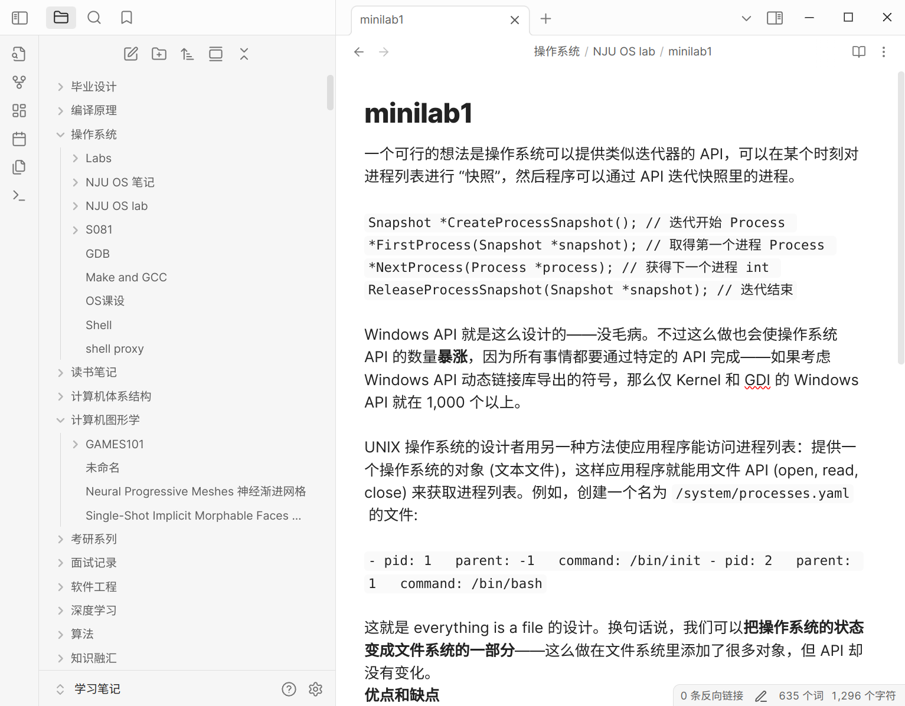
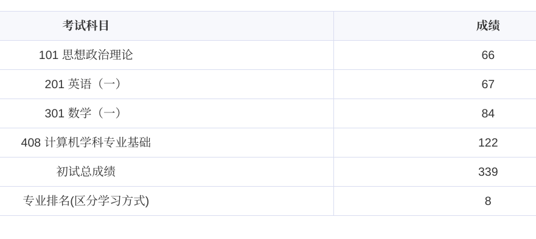

# 南京大学软件学院

> 408，择校，信息查找

### 1.前言

去向：南京大学 软件学院 11408

在一开始想确定自己想走什么方向还是挺困难的，如果你想国内升学的话，我还是更推荐你好好学习课程，争取保研。平时好好上课，复习的时候多找一些往年题，相同的科目比如专业课、数学课，期末考试同考研比起来难度还是低挺多的，但是贵在坚持吧，能坚持到底的人我觉得寥寥无几。但考研备考又不是不用坚持，你同样很难受，不如平时认真学。再就是，千万别听信各种所谓的只要不保研绩点就不重要的言论，就我们目前所见到的，留学就不用说了，绩点是硬性要求。考研和工作对绩点没什么太多要求，但绩点别太难看，尤其是不要挂科。

到大三会有一门与 CSP 有关的课程，这门课如果你之前没有 ACM 或者信息竞赛背景，对算法题一窍不通的话，一定要好好学。起码要学到 leetcode hot 100 你做起来不会觉得太难，好好想想基本都能做出来的程度吧。拿我个人经历来说，我在进入复试的 9 个人中排第 8 名，第 9 名其实与我同分。而录取名额是 6 个人，第六名比我初试分数高出 18 分，我们这一年机试不算太难，考前保持状态我做了 40 道 hot 100，然后去考试，最后分数是 351/400,排名大概 15/170 左右，仅仅依靠机试就帮我扳回十多分，后面加上面试扳回的分数刚好最后一名录取。

在考研被录取前，一度觉得自己上岸无望，投过很多简历，大中厂基本都要求机试，虽然有的会可能直接给面试。比如我投过的直接给面试的有百度的一个 AI 相关岗位、蚂蚁的测试开发。但可以说 90% 都会要求先机试，通过机试初筛才可能有面试资格。而且即便是面试，也会要求手撕算法题，或者考你一些隐含了数据结构优化时间复杂度思想的「智商题」。不过我只面试了蚂蚁的岗位，后面被录取后就放弃所有面试了。当然，要工作的话，最重要的还是技术、项目、八股，会算法是门槛。

一手抓这个、一手抓那个，肯定不现实，我也不能把自己没做的当作给别人的建议，毕竟那可能只是我的幻想。所以后面内容也是接着结合自己的经历给大家讲讲吧。总结下前面说的，平时好好学，算法也要好好学。其中数据库的大作业和软工的课设都会要求做一个 web 项目，这两个推荐大家好好做。毕竟就业的话，最多的岗位还是前后端，虽然这两个是跟别人合作的项目，但还是建议大家别怕多干活，哪怕自己全做了，做一个项目是可以让你对相关技术栈深入了解一大步的。何况我觉得用代码把自己想法实现出来，然后不断打磨完善是一个很让人着迷的过程，可以让人废寝忘食。至少对于我是这样。做好一点，多用些先进的技术，哪怕最后你是考研失败被迫找工作，之前没有找工作的意向，起码有拿得出手，同岗位要求相匹配的东西。而且做了你才知道自己擅长与否，是否喜欢，这是宝贵的低成本试错机会，不然被迫去到完全不想去的相应岗位打工，那才是遗憾。

虽然我们会推荐一些网上优秀的课程，可是回首三年，我觉得山大有许多好老师，比如指导我毕设，给大家上算法设计与分析的姜老师，还有给我们这个指南贡献内容的尹老师。还有许多其他给学生带来帮助的优秀老师。有些老师上课还是很好的，比如郑老师讲的编译原理，就很透彻，听他讲课你就能感觉到编译原理所有的内容他都了如指掌，那些复杂的归约过程他都信手拈来。还有就是姜老师讲算法，也讲得很好，逻辑缜密，行云流水，反正我觉得听他们讲逻辑性好的课就是一种享受。

其实我还想说，不知道对哪个方向感兴趣就多尝试，多学相关的课程，多了解相关技术，记得动手做点小项目，没准它跑起来的一瞬间，你就喜欢上了。我学过很多比较杂的东西，比如参加 miniob 的时候了解过这个数据库的底层，觉得很有意思。学习 jyy 的操作系统，去实现一个跑在裸机上的操作系统，借助 linux 指令去做个任务管理器、实现协程，我也觉得挺有意思。学机器学习和 NLP 中的 word vector,感觉也挺神奇挺有意思的。可能是我比较好奇这些东西如何运行的，并且喜欢亲自实现，所以我还是挺喜欢写代码、了解未知领域的。不过你要说上面这些哪个我最感兴趣，我自己也不知道，但是他们汇在一起，又构成了我的知识体系，让我能看看各个层是咋跑起来的。感兴趣就去做，多学学，学会了，做出来了，自然会有乐趣。

还有一些细节的，比如大家可以把学过的技术、遇到的 bug 整理下来，可以写成博客，也可以自己留着，因为时间久了，真的会忘。遇到面试，总要讲讲项目吧，总要讲讲经历吧，拿出来看一看，帮助良多。记笔记推荐 `Obisidian`，在里面用 `Markdown` 就好。考研面试前一晚，看上面曾经记的操作系统、数据库、web 的一些项目的记录看到两点，再梳理一遍，最后对我起了莫大的帮助。
<figure><figcaption>
考研分数
</figcaption></figure>

### 2. 复习经验

网上的关于如何复习取得初试高分的经验贴已经很多了，大家直接参考他们的经验贴就可以，我就说说我复习过程中的教训吧，可以看到我的数学只有 84 分，还不及格，好在南大不卡 90 分的数学线。我觉得我数学学习最大的问题就是，刷题太少，听课太多。这就会带来一种仿佛我什么都听懂了，可是一做题却发现全忘记了，这种情况一定要避免！尤其是 25 年张宇的新 36 讲，会占用大量的时间，如果要学这本书，一定要留足够的时间，否则会严重耽误后面做真题和套卷，而后面大量刷题的时候往往又是分数快速提升，整合知识的时候。而我只做了 5 年的真题和 4 套张宇的卷子就去考试了，考前很多东西也都忘记了，所以只有区区 84 分，大家一定要以我为戒。

我的 408 分数还可以，很大一部分原因我觉得是复习的比较仔细。除了王道的四本书和所有真题，我还主要参考了一些教材，很多人觉得黑书更好，更通俗易懂，但我觉得有时候看黑书有些「political right」，因为出题的依据还是国内教材，很多东西是国内教材有而我们上专业课用的黑书上没有的，但确实有些内容黑书介绍的会更容易理解。多理解知识，然后去做对应的习题，会不断加深理解同时提高分数。复习经验就讲这些吧，因为网上有许多更好的经验贴，如何考高分学习他们就可以，如何避免数学太低，可以看看我写的。

<figure><figcaption>
考研分数
</figcaption></figure>

### 3. 择校

考研择校尤其是在 11408 这一科目选择上会有很多备选学校，我在考研过程中也经历了反复比较和选择的过程，在这一过程中我也有许多思考。\
首先最重要的肯定是分数，我觉得 3 个因素很重要，学校历年复试线，历年平均分，最后一个很多人都没提到过，但我觉得对择校非常重要，就是你认为这个学校「值」多少分。历年复试线和平均分我们可以看出每年学校分数线的大致走势和学生水平。如果平均分比分数线高出很多，说明学校当年只是因为最后几名分数较低，想要被录取，最好要看初试中录取名次那一名的分数，比如招 9 进 6，就要看第六名的分数。如果擦线进入复试你可能需要在复试中逆袭许多的分数才可能上岸。但我觉得更重要的是你觉得这个学校值多少分，拿软微举例，我觉得这种级别，360-370 分数线，380-390 平均分也不算过分，毕竟软微也是北大，清北独一档，这是毫无争议的。这样即便前一年可能爆冷分数线只有 350，但你有了自己的估计后自己仍会明白自己应该参考怎样的分数。\
这种估计就要在最近几年初试平均分的均值基础上综合考虑学校的层次、地理位置、计算机的学科水平乃至校园环境。比如南京大学的智能科学与技术，师资非常雄厚，院长是院士且是南京大学的党委书记，学院资源自然非常充足。学院老师背景都很强，而且研究方向基本都是 AI 里面很热门的领域，在苏州校区整个校园环境都非常好。但是由于校区 2022 年才开始招生，很多人对这个学院都没听说过，前几年都比较冷门。综合他的条件，我觉得这种层次的专业，他的分数线即便是专硕也值得江苏 11408 分数线 345，平均分 365-375。在考前有个小程序叫呱呱严选，有实时报录比，这个学院一度达到了 10:1，这个小程序人数还是比较准确，所以最后我没有选择报名这个学院，最后分数线 337，均分 356，比我认为的价值整体低 10 分左右。我觉得一是因为了解这个学院或者说南大苏州校区的人仍不是很多，再就是互联网行业北上广深更有便于就业实习，再综合成本，北京的学校会很受青睐。\
我觉得对专业分数线有合理预期，才不容易出现低分高报。再就是复旦和上交专硕由于 3 年总费用大约在 20w 以上，导致分数线在华五专硕中偏低。其次就是一些招生人数很少的学硕，分数波动往往非常大，经常出现过山车的走势，如果你有足够的实力，又想冲一把，可以考虑选择这些，他们风险很高，但是如果当年没人敢报，最后收益也极高，但如果实力不够，要做好二战的准备。比如我考的软件学院的学硕，这个学院专硕很热门，但是学硕几乎无人知晓，加上软件学院资源和老师往往不及计算机学院的配置，常年分数线较低，这时历年平均分参考意义不大，因为低于学校的价值，我觉得他的价值一般在 350 左右的分数线，360-370 的平均分。我考的这一年虽然分数线只有 339，但是均分已经来到了 362 分。如果你真的想冲好学校而且对复试非常自信，可以尝试报考这种可能低分进复试的专业，但也要做好分数极其爆炸的准备，毕竟招 6 个人，随便来几个 380+的人就把名额占满了。但从我这一年结果来看，敢于冲刺小池子的人是比较少的，高分同学还是更青睐大池子，但小池子里往往也会有高手出现，这个时候就看运气好不好了，也就是选择小池子的高手多不多了。\
再比如南京大学计算机学院或者人工智能学院这种科目强势，师资雄厚，名声在外的学院的专业，他们即便是专硕，分数线一般也会在 350-360 分以上，历年平均分在 370-380 左右更是不足为奇，学硕分数甚至会更高一个层次。\
最后我想说我们报考不能只考虑这个专业哪里好，因为人都是贪婪的，它的好处你想占，其他人也会想占，就比如很多人吹嘘的南京大学软件学院专硕，25 年之前他分数低，学校层次高，还是两年制，放实习有助于就业，二战失利报考能与前一年应届上岸的人同时毕业，25 年第一年改考 408 是优中之优，结果最后复试线高达 372 分，这足以说明大众充满了盲从，有时候逆流而行，未必是坏事。所以我觉得要综合它的好处和弊端，结合历年分数，对这个专业的价值进行估计。好处就加分，比如学校层次高、老师都很优秀、资源多待遇口碑俱佳、地理位置优越尤其是北京上海等可以加分，而学院在学校相对弱势、地理位置不好等就可以减分。前期可以先了解信息，估计能力确定科目和大致的目标，比如选 11408 还是 22408，可以将一些学校备选，到了报名前，前一年真题评估下自己的水平再进行报名。

### 4. 写在最后

在考研过程中，只要进了复试，不要因为和有效名次最后一个人分数差距比较大就选择放弃，提前复习复试科目，更不要在出分之前就放弃，因为很可能扩招最后你进入复试，出分之后也会有扩招的可能，一定要坚持到最后一刻，不要留下遗憾！而且人生的路很长，一时的挫折不意味着彻底失败，当你 50 岁回头看过去的几十年，晚一年上岸研究生，对你的人生真的影响那么大吗？何况即便是上岸的人，很可能只是运气比你好罢了。有什么问题可以联系我 qq:1078314987。

SDU 21 级计科 zhang shuai\
2025.6.1
