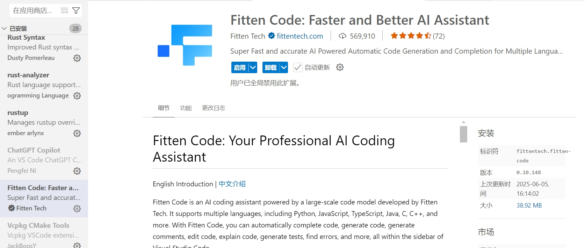
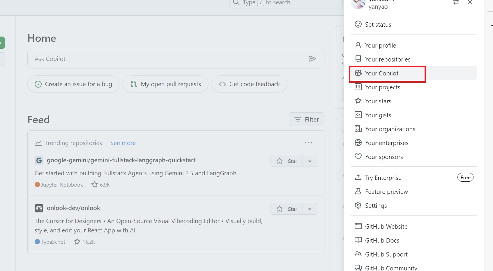
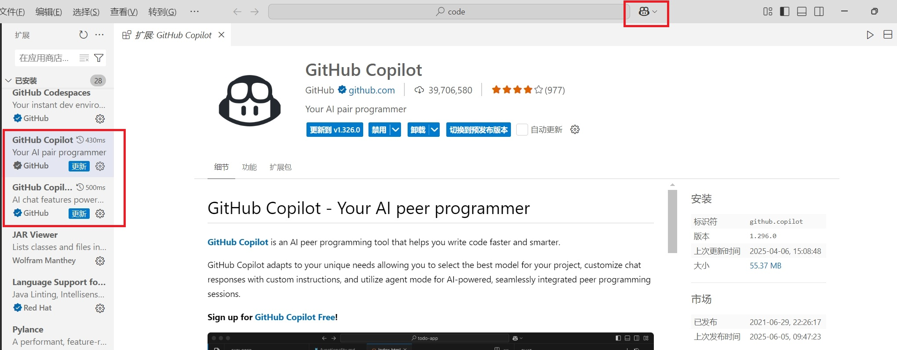
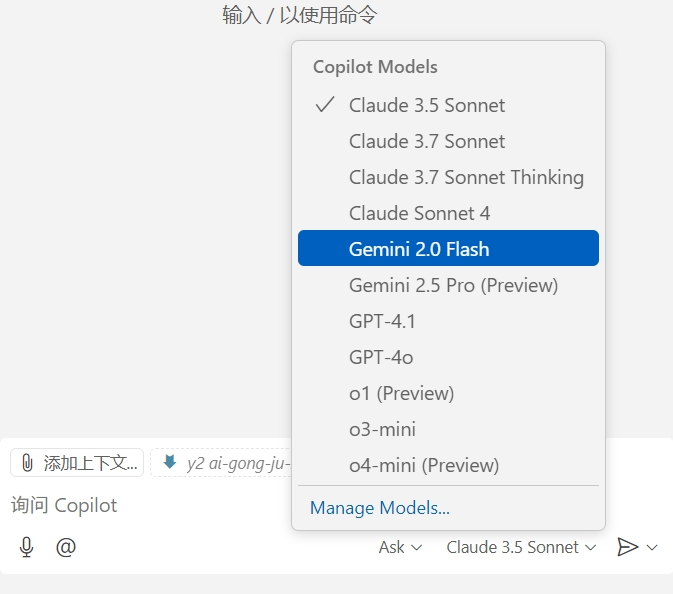
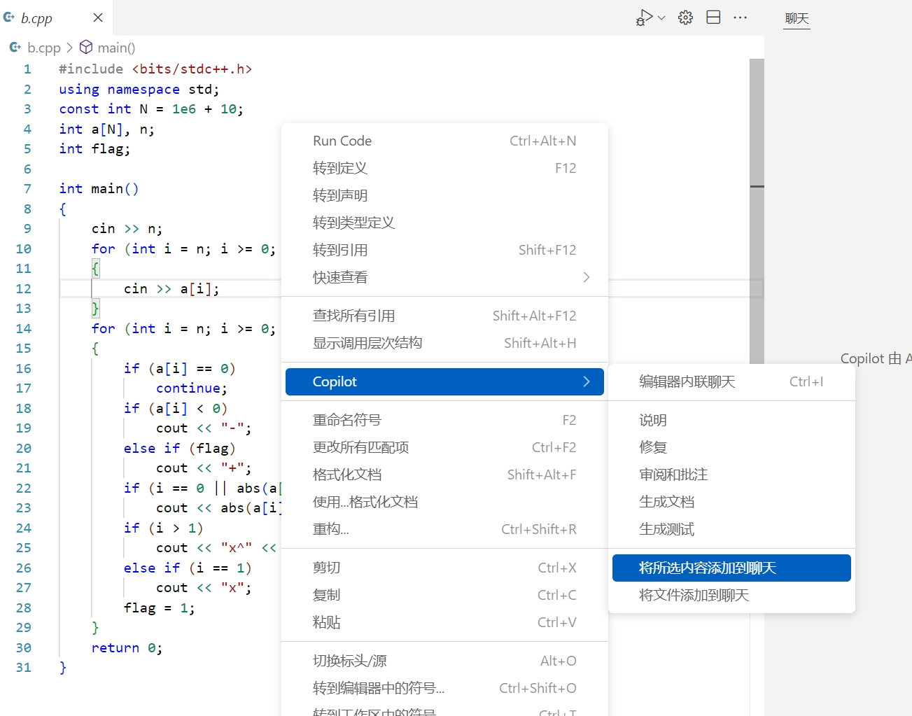
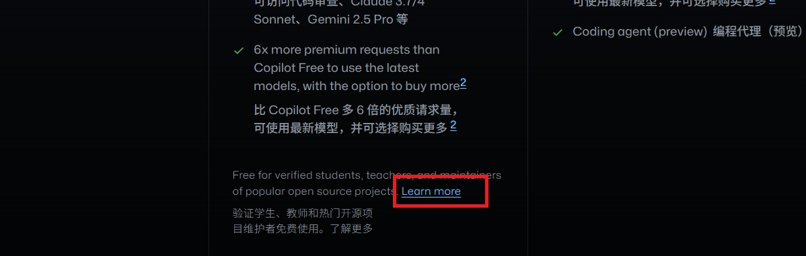
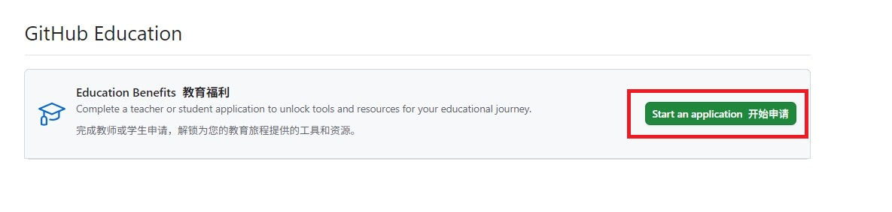
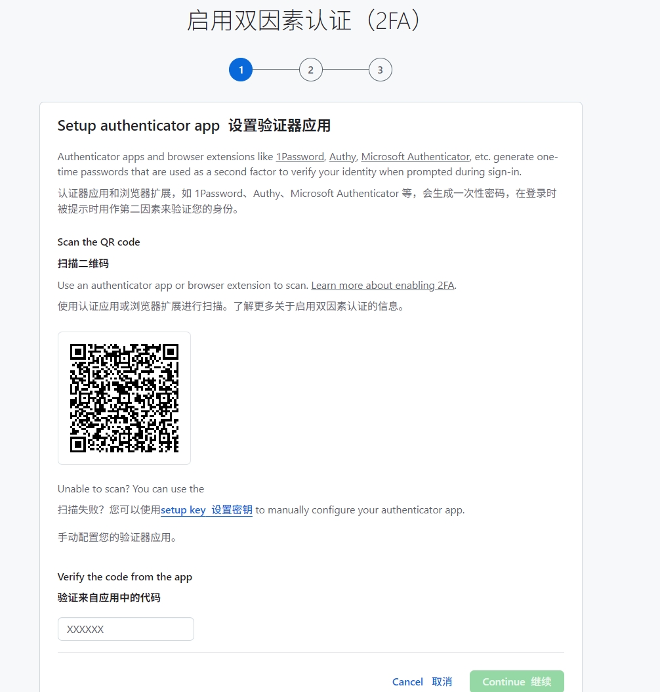

# 好用的AI工作助手--Copilot和Fitten Code

很多ai都有相应的网页，编程时需要来回切换。github里的Copilot可以内置在多种代码编译器中（Eclipse、JetBrains IDEs、VScode等），里面有许多ai模型可供使用（Claude、Gemini、gpt等），并且经常更新，可以有效帮助我们提高写代码以及改bug的效率。
国产的VSCode AI：Fitten Code也十分好用，直接在VSCode的扩展里搜索添加，之后可以使用微信或者其他方式登录。Fitten Code可以进行自己编写规则实现个性化设置，现已接入DeepseekV3和DeepseekR1。

<figure><figcaption></figcaption></figure>
在VScode中Copilot和Fitten Code扩展可能会冲突，使用的时候要注意。

## 如何使用Copilot？

Copilot可以使用学生认证免费试用，具体流程可以上网搜索，下面也会写。

1. 进入github，点击自己头像，出现"Your Copilot"，点进去。

<figure><figcaption></figcaption></figure>

2. 里面有免费的Copilot，不过有使用限制，可以先试用，觉得好用再申请学生认证。
3. 可以在VScode里安装Copilot相应的扩展，安装后上方搜索框右边会出现Copilot图标，点击即可使用。

<figure><figcaption></figcaption></figure>
右下方可以切换ai模型。
<figure><figcaption></figcaption></figure>
可以选定代码的一段或者整个文件添加到聊天框中进行问答。
<figure><figcaption></figcaption></figure>

## Copilot如何申请学生认证？

1. 点击"Upgrade"，在"Pro 专业版"下面的"Learn more"加入GitHub Education

<figure><figcaption></figcaption></figure>
<figure><figcaption></figcaption></figure>
2.  填写相应信息，使用学校邮箱。这里可能需要使用2FA，这个设置之后每次登录github不仅需要输入密码，还要输入口令。这里我在手机上下载了NetIQ Auth，扫码后会有一个限时口令，输到框里。之后按提示进行即可。
 <figure><figcaption></figcaption></figure>
3.  继续刚才的操作，会发一封邮件到学校邮箱里，点进去跟着操作即可。
